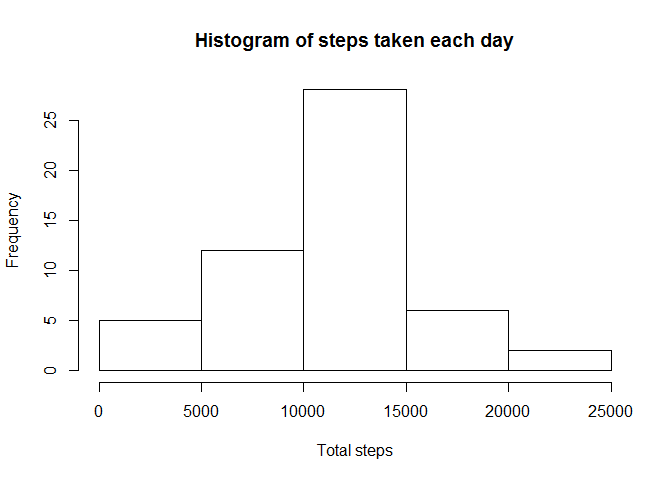
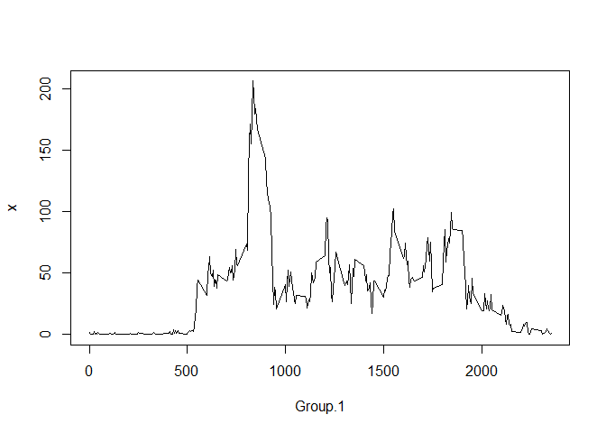

# Reproducible Research: Peer Assessment 1

## Loading and preprocessing the data

```r
unzip("activity.zip")
activity_data <- read.csv("activity.csv") 
```

## What is mean total number of steps taken per day?

For this part of the assignment, you can ignore the missing values in the dataset.  
1. Make a histogram of the total number of steps taken each day  


```r
#Take a subset of data ignoring missing values
activity=subset(activity_data, activity_data!='NA')
#aggregate by day
total_steps_by_day = aggregate(activity$steps, by=list(activity$date), FUN="sum")
#produce histogram
hist(total_steps_by_day$x, main="Histogram of steps taken each day", xlab="Total steps")
```

 

2. Calculate and report the mean and median total number of steps taken
per day

```r
mean(total_steps_by_day$x)
```

```
## [1] 10766.19
```

```r
median(total_steps_by_day$x)
```

```
## [1] 10765
```

## What is the average daily activity pattern?
Make a time series plot (i.e. type = "l") of the 5-minute interval (x-axis)
and the average number of steps taken, averaged across all days (y-axis)

```r
avg_steps_by_interval = aggregate(
  activity$steps, 
  by=list(activity$interval), 
  FUN="mean")
plot(avg_steps_by_interval, type="l")
```

 

2. Which 5-minute interval, on average across all the days in the dataset,
contains the maximum number of steps?

```r
row_idx=which.max(avg_steps_by_interval$x)
avg_steps_by_interval[row_idx,]$Group.1
```

```
## [1] 835
```
Interval with the label 835 on average contains the maximum number of steps at mean 206.17.

## Imputing missing values

Note that there are a numb er of days/intervals where there are missing values (coded as NA). The presence of missing days may introduce bias into some calculations or summaries of the data.  
1. Calculate and report the total number of missing values in the dataset
(i.e. the total number of rows with NAs)  

```r
ok<-complete.cases(activity_data$steps)
missing_data_cnt<-sum(!ok)
```
There are 2304 records with missing data.

2. Devise a strategy for filling in all of the missing values in the dataset. The strategy does not need to be sophisticated. For example, you could use the mean/median for that day, or the mean for that 5-minute interval, etc.  
Using 5-minute interval mean as imputed value for records with missing data is a suitable approach in this scenario.

3. Create a new dataset that is equal to the original dataset but with the
missing data filled in.  
4. Make a histogram of the total number of steps taken each day and Calculate and report the mean and median total number of steps taken per day. Do these values differ from the estimates from the first part of the assignment?  
What is the impact of imputing missing data on the estimates of the total
daily number of steps?  


## Are there differences in activity patterns between weekdays and weekends?

For this part the weekdays() function may be of some help here. Use the dataset
with the filled-in missing values for this part.
1. Create a new factor variable in the dataset with two levels - "weekday"
and "weekend" indicating whether a given date is a weekday or weekend
day.
2. Make a panel plot containing a time series plot (i.e. type = "l") of the
5-minute interval (x-axis) and the average number of steps taken, averaged
across all weekday days or weekend days (y-axis). The plot should look
something like the following, which was creating using simulated data:
Your plot will look different from the one above because you will be using
the activity monitor data. Note that the above plot was made using the lattice
system but you can make the same version of the plot using any plotting system
you choose.
